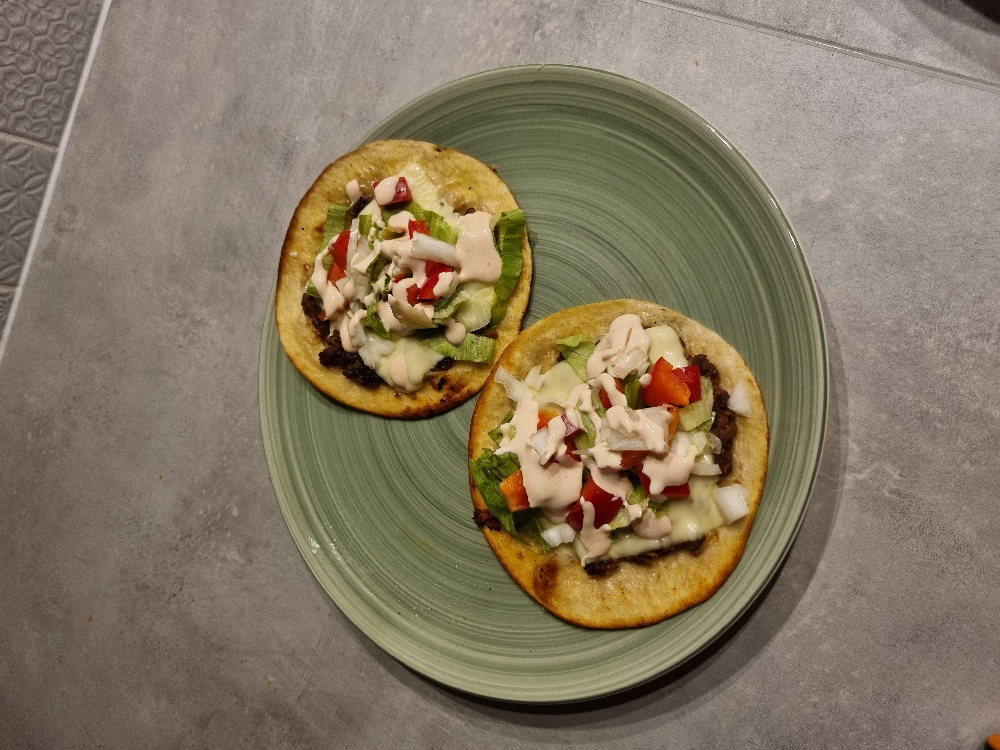

## Burgeri takod

### Koostisosad
- Väikesed tortillad
- Hakkliha
- Juust
- Jääsalat
- Valge sibul
- Paprika
- Hapukoor
- Ketšup
- Küüslauk

### Valmistamine:
- Maitsesta hakkliha soola, pipra, küüslaugu ning muu meelepärasega.
- Haki valmis jääsalat, paprika ja sibul.
- Sega kokku hapukoor ning ketšup (kastmena võib kasutada ka teisi kastmeid: näiteks burgerikaste)
- Tee hakklihast kätega pallike ning vajuta see tortilla peale lapikuks, nii et hakkliha ulatuks äärteni.
- Pane tortilla pannile, hakklihaga pool allpool, ning küpseta kuni hakkliha on läbi küpsenud ja pruun.
- Pööra tortilla ümber ning lisa juustu.
- Kui juust on sulanud tõsta tortilla pannilt. Lisa jääsalat, paprika ning sibul. Lisa kaste ning voldi tortilla kokku.
