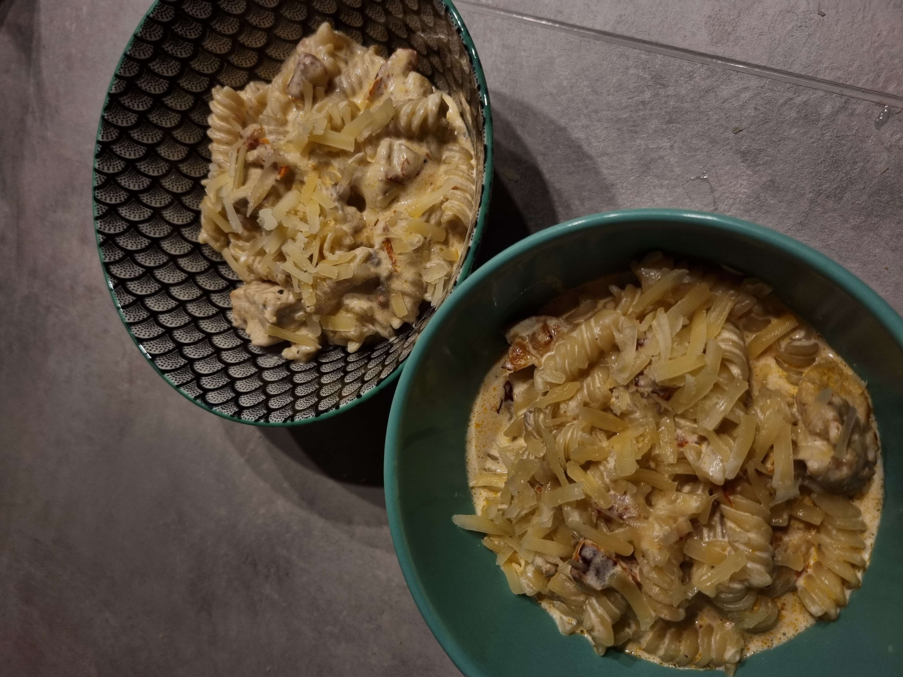

## Kanapasta

### Koostisosad
- Kana
- Koor
- Makaronid
- Parmesan

### Valmistamine

- Lõika kana tükkideks ning prae õli/võiga
- Maitsesta soola ja pipraga (lisada võid veel küüslaugupulbrit, tšillit).  Võid lisada ka näiteks päiksekuivatatud tomateid.
- Pane makaronid soolaga maitsestatud keevasse vette ning järgi juhiseid pakil. Jäta natuke keeduvett alles.
- Kui kana on küps, võta kuumust vähemaks ning lisa koor. Sega kõik läbi.
- Riivi parmesan ja lisa see kastmesse.
- Maitse ning vajadusel maitsesta.
- Kui parmesan on kastmes ära sulanud lisa natukene makaronide keeduvett, seejärel võid kastme ning makaronid kokku tõsta.

