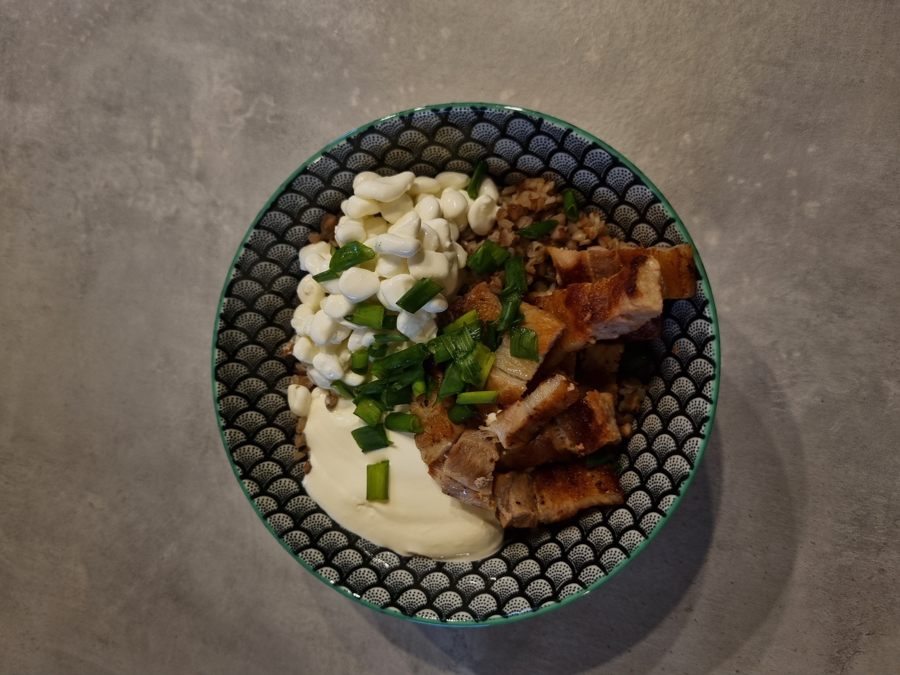

## Tatar peekoniga

### Koostisosad
- Tatar
- Paks peekon
- Hapukoor
- Roheline sibul

### Valmistamine
- Prae pannil peekon soola ja pipraga.
- Keeda tatar soolaga maitsestatud vees.
- Lõika peekon suupärasteks tükkideks.
- Serveeri tatar koos peekoni, hapukoore ja rohelise sibulaga. (Võid veel lisada kodujuustu, kurki, tomatit või sibulat)

