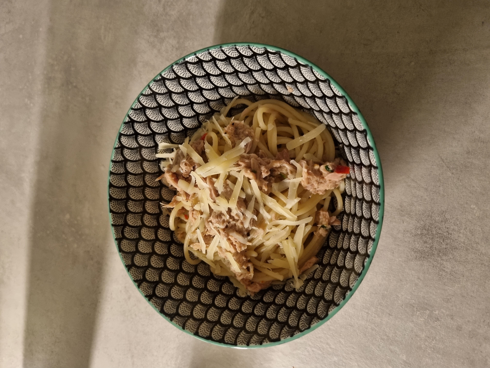

## Tuunikala pasta

### Koostisosad
- Tuunikala
- Spagetid 
- Parmesan
- Tšilli 
- Küüslauk 

### Valmistamine
- Keeda spagetid vastavalt pakil olevatele juhistele
- Madalal kuumusel lisa pannile õli ning prae selles tšilli ja küüslauk
- Lisa pannile tuunikala ning sega läbi
- Lisa pannile spagetid ja ka natukene keeduvett, millest tekib kaste
- Maitsesta soola ja pipraga
- Serveeri koos parmesaniga

